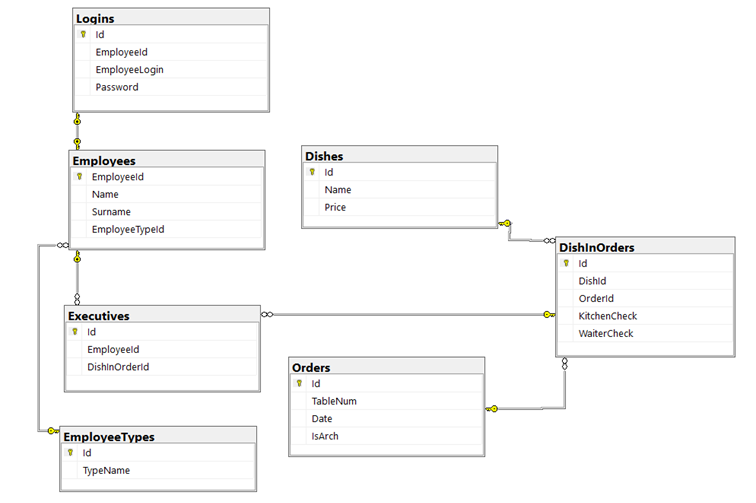

# CookApp

CookApp is an application designed to assist in order management within dining establishments, allowing waitstaff to place orders and assign them to chefs. The system is created to optimize kitchen operations and facilitate communication between waitstaff and chefs.

## How CookApp Works

The app has two types of user accounts: waiter and chef. Each waiter can place orders, assigning dishes to specific tables, while chefs prepare the assigned dishes. The system includes a queue mechanism that ensures tasks are evenly distributed among chefs and informs waitstaff when dishes are ready for pickup.

### Example Workflow:
1. A waiter adds an order consisting of several dishes.
2. Dishes are automatically distributed among available chefs.
3. When all chefs are busy, orders are added to a queue. As soon as a chef completes an order, they immediately receive the next dish from the queue.
4. The chef prepares the dish and marks it as ready, which releases the next dish for preparation.
5. The waiter receives a notification that the dish is ready to be served to the customer.

## Application Architecture

The application is built on the .NET platform, utilizing WPF and ASP.NET Core Web API technologies. The architecture includes:

- **WPF Application** – The user interface for waitstaff and chefs.
- **Web API** – Manages communication with the database.
- **Database** – Stores information on orders and users.

## Database Structure

The database is created using Microsoft SQL Server and includes tables related to orders, dishes, and users. Each order can contain multiple dishes, and each dish is assigned to chefs based on availability.

## Application and API Communication

Communication between the WPF application and the web API occurs over HTTP, using JSON for data exchange. The API is designed with Entity Framework and supports asynchronous requests, enabling smooth interaction with the database.

## Technologies and Add-ons Used

- **WPF Application**: .NET 7.0 (Windows), including Entity Framework Core, Newtonsoft.Json
- **Web API**: ASP.NET Core Web API, OpenAPI
- **Database**: Microsoft SQL Server 2022

## Preview

### Login Panel

---
### Chef Panel

---
### Waiter Panel - Place Order

---
### Waiter Panel - View Order

## License

This project is licensed under the terms of the MIT License. Details can be found in the LICENSE file.
