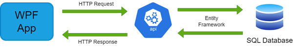

# CookApp

CookApp to aplikacja wspomagająca zarządzanie zamówieniami w lokalach gastronomicznych, umożliwiająca kelnerom składanie zamówień i przydzielanie ich do kucharzy. System jest zaprojektowany, aby zoptymalizować pracę kuchni i ułatwić komunikację między kelnerami a kucharzami.

## Spis treści
- [Opis aplikacji](#opis-aplikacji)
- [Jak działa CookApp](#jak-działa-cookapp)
- [Architektura aplikacji](#architektura-aplikacji)
- [Budowa bazy danych](#budowa-bazy-danych)
- [Komunikacja aplikacji z API](#komunikacja-aplikacji-z-api)
- [Użyte technologie i dodatki](#użyte-technologie-i-dodatki)
- [Instalacja](#instalacja)
- [Licencja](#licencja)

## Opis aplikacji

CookApp wspiera obsługę lokalu gastronomicznego, upraszczając proces składania zamówień przez kelnerów oraz ich realizację przez kucharzy. Aplikacja umożliwia zarządzanie kolejnością realizacji zamówień oraz optymalne przydzielanie zadań dostępnemu personelowi.

## Jak działa CookApp

Aplikacja posiada dwa typy kont użytkowników: kelnera i kucharza. Każdy kelner może składać zamówienia, przypisując dania do konkretnych stolików, natomiast kucharze realizują przydzielone im dania. W systemie wprowadzono mechanizm kolejki, który dba o równomierne przydzielanie zadań kucharzom, a także informuje kelnerów o gotowości dań do odbioru.

### Przykład działania:
1. Kelner dodaje zamówienie złożone z kilku dań.
2. Dania są automatycznie przydzielane dostępnemu kucharzowi.
3. Gdy wszyscy kucharze są zajęci, zamówienia odkładają się do kolejki. Gdy tylko jakiś kucharz obsłuży zamówienie, natychmiast dostaje kolejne danie z kolejki.
4. Kucharz realizuje danie i oznacza je jako gotowe, co natychmiast uwalnia kolejne danie do realizacji.
5. Kelner otrzymuje informację o gotowym daniu, które może zanieść klientowi.

## Architektura aplikacji

Aplikacja została zbudowana na platformie .NET, z wykorzystaniem technologii WPF oraz ASP.NET Core Web API. Architektura aplikacji składa się z:

- **Aplikacji WPF** – interfejsu użytkownika dla kelnerów i kucharzy.
- **Web API** – obsługującego komunikację z bazą danych.
- **Bazy danych** – przechowującej informacje o zamówieniach i użytkownikach.

## Budowa bazy danych

Baza danych została utworzona przy użyciu Microsoft SQL Server i zawiera tabele związane z zamówieniami, daniami i użytkownikami. Każde zamówienie może zawierać wiele dań, a każde danie jest przypisywane kucharzom w zależności od dostępności.

## Komunikacja aplikacji z API

Komunikacja między aplikacją WPF a API webowym odbywa się za pomocą protokołu HTTP, wykorzystując format JSON do wymiany danych. API zostało zaprojektowane w oparciu o Entity Framework i obsługuje asynchroniczne żądania, które umożliwiają płynną interakcję z bazą danych.

## Użyte technologie i dodatki

- **Aplikacja WPF**: .NET 7.0 (Windows), m.in. Entity Framework Core, Newtonsoft.Json
- **Web API**: ASP.NET Core Web API, OpenAPI, Swashbuckle
- **Baza danych**: Microsoft SQL Server 2022

##Preview

## Running the Application

For detailed instructions on how to run the SmartStaff application on a local server, please refer to the [INSTALL.md](./INSTALL.md) file. There, you will find the necessary steps to set up the environment and run the application.

## Licencja

Ten projekt jest licencjonowany na warunkach licencji MIT. Szczegóły w pliku LICENSE.
